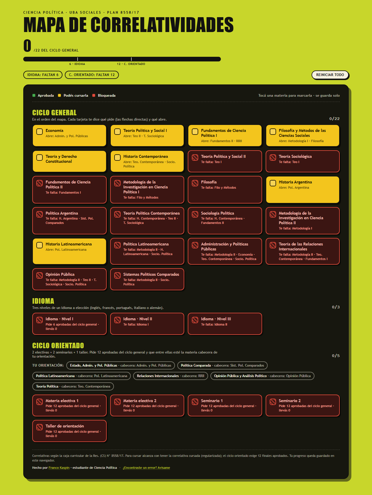

# Mapa de Correlatividades · UBA Sociales

Tracker interactivo de correlatividades de las carreras de la **Facultad de Ciencias Sociales (UBA)**. Marcás las materias que aprobaste y el mapa te dice, materia por materia, qué correlativas te pide, cuáles te faltan y qué se te abre.



**Producción:** https://mapa-correlatividades-ubasociales.vercel.app/

## Cómo se usa

- Elegís tu carrera en la portada y tocás las materias que ya aprobaste.
- Cada tarjeta muestra su estado — **aprobada**, **podés cursarla** o **bloqueada** — con las correlativas que pide y las que habilita.
- Además de las correlativas directas, calcula los hitos de cada plan (idioma, ciclo orientado, títulos intermedios, TIF).
- Opcionalmente cargás la **nota** de cada materia aprobada y ves el **promedio** (acepta coma o punto; es solo tuyo).
- El progreso se guarda en el navegador (`localStorage`): se conserva al recargar y no viaja a ningún servidor.

## Las cinco carreras

| Carrera | Plan / resolución fuente |
|---|---|
| **Ciencia Política** | Plan 8558/17 · Res. (CS) N° 8558/17 |
| **Sociología** | Plan 2282/88 · correlatividades Res. (CD) N° 186/2024 |
| **Ciencias de la Comunicación** | Dos planes vigentes: Plan 504/23 y Plan 440/90 «a extinguir» (tronco: Res. N° 5396/09) |
| **Relaciones del Trabajo** | Res. (CS) N° 1440/90 y Res. (CD) N° 1161/93 · título intermedio «Analista en Relaciones del Trabajo» (Res. (CS) N° 74/85) |
| **Trabajo Social** | Plan 5962/12 · Res. (CS) N° 5962/12 |

**Ningún dato inventado:** cada materia, correlativa e hito está trazado a la resolución oficial de su carrera. Las notas al pie de cada mapa citan la fuente exacta.

## Stack

[Vite](https://vite.dev/) + [React](https://react.dev/) (JavaScript), SPA con hash routing, mapa data-driven y deploy estático en [Vercel](https://vercel.com/).

Cada carrera vive en un archivo de datos (`src/data/carreras/`); un único componente genérico (`src/MapaCarrera.jsx`) los renderiza y `src/data/evaluator.js` resuelve correlativas y notas.

## Correr localmente

Requiere Node 18+.

```bash
npm install     # instalar dependencias
npm run dev     # servidor de desarrollo (http://localhost:5173)
npm test        # tests (vitest)
npm run build   # build de producción en dist/
npm run preview # sirve el build de dist/ para verificar
```

## Assets

La imagen de previsualización para redes (`public/og-image.png`, 1200×630) se genera con [`scripts/gen-og.mjs`](scripts/gen-og.mjs) (requiere `@napi-rs/canvas`).

## Licencia

[MIT](LICENSE) · Copyright (c) 2026 Franco Kaspin.
